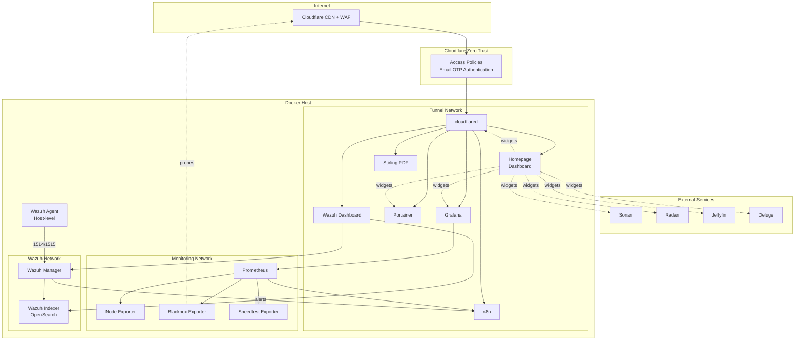
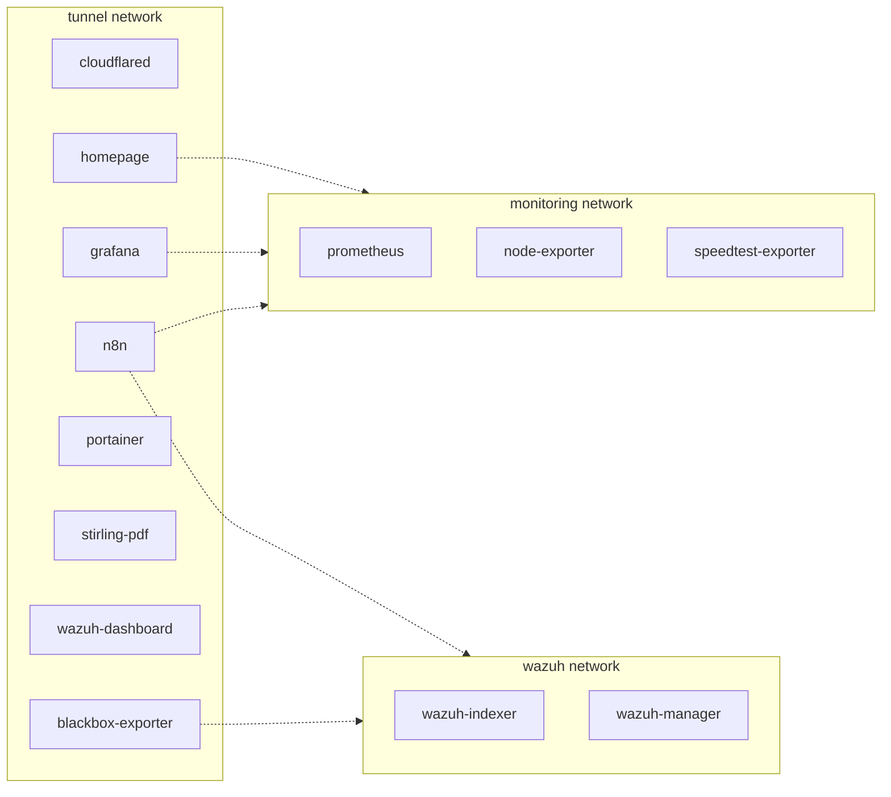
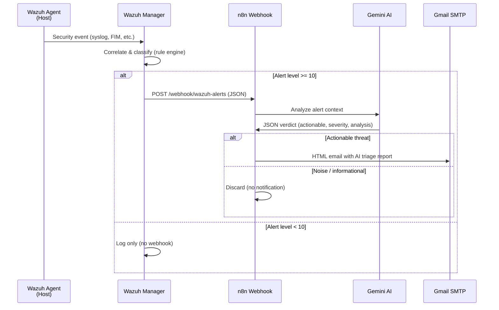
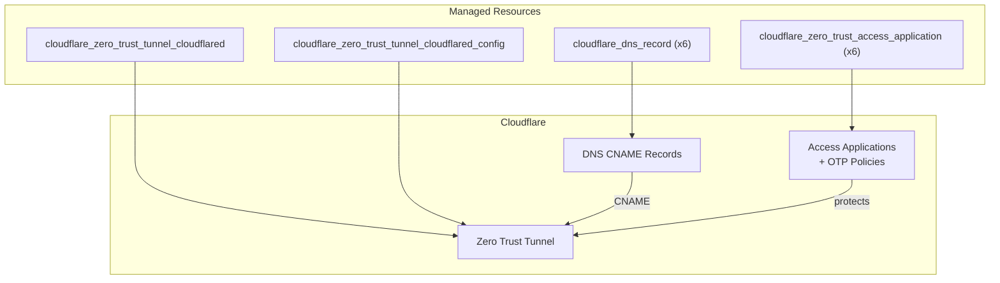

# Homelab

A single Docker Compose stack running 13 containers with Terraform-managed Cloudflare infrastructure. Everything is Infrastructure as Code — no manual configuration, no secrets in version control.

## Architecture



## Network Topology



Services connect to multiple networks as needed. Only `cloudflared` faces the internet. Prometheus, Node Exporter, and Speedtest Exporter have no tunnel access.

## Wazuh Alert Pipeline



## Terraform Infrastructure



Terraform manages ~15 resources: the tunnel, its ingress config, 6 DNS records, and 6 Zero Trust access policies (one per public service). All services require email OTP authentication before reaching the application.

## Services

| Service | Purpose | Public | Port |
|---------|---------|--------|------|
| **cloudflared** | Cloudflare Tunnel ingress | Gateway | - |
| **homepage** | Dashboard with service widgets | `https://domain.com` | - |
| **portainer** | Container management | `https://portainer.domain.com` | - |
| **stirling-pdf** | PDF manipulation tools | `https://pdf.domain.com` | - |
| **n8n** | Workflow automation | `https://n8n.domain.com` | - |
| **grafana** | Metrics visualization | `https://grafana.domain.com` | - |
| **prometheus** | Metrics storage | Internal only | - |
| **node-exporter** | Host metrics collector | Internal only | - |
| **blackbox-exporter** | HTTP/ICMP probes | Internal only | - |
| **speedtest-exporter** | Internet speed metrics | Internal only | - |
| **wazuh-indexer** | OpenSearch alert storage | Internal only | - |
| **wazuh-manager** | SIEM analysis engine | Internal only | 1514, 1515, 55000 |
| **wazuh-dashboard** | Security monitoring UI | `https://wazuh.domain.com` | - |

## Security

### Double-Layer Authentication
Every public service is protected by two layers:
1. **Cloudflare Zero Trust** — email OTP gate before any traffic reaches the server
2. **Application-level login** — each service has its own credentials

### Container Hardening
All containers follow a hardened baseline:
- `security_opt: [no-new-privileges:true]`
- `cap_drop: [ALL]` — only add back capabilities that are strictly required
- `read_only: true` with `tmpfs` mounts where possible
- No containers expose ports to the host except Wazuh Manager (agent enrollment)

### Secrets Management
- **Docker**: All secrets live in `.env` (gitignored). Config files use `${VAR}` substitution.
- **Terraform**: Sensitive values in `terraform.tfvars` (gitignored). API token marked `sensitive = true`.
- **Homepage**: Uses `{{HOMEPAGE_VAR_*}}` template syntax — credentials injected via environment variables at runtime.
- **Portainer**: Admin password stored as a Docker secret (`./secrets/`).
- **Wazuh**: TLS certificates in `files/wazuh/certs/` (gitignored).

## Project Structure

```
homelab/
├── docker-compose.yml              # All 13 services
├── .env.sample                     # Environment template (copy to .env)
├── .gitignore
├── secrets/                        # Docker secrets (gitignored contents)
├── files/
│   ├── grafana/
│   │   └── provisioning/
│   │       ├── dashboards/         # 4 pre-built dashboards
│   │       │   ├── homelab-overview.json
│   │       │   ├── internet-connection.json
│   │       │   ├── n8n-system-health.json
│   │       │   └── node-exporter-host.json
│   │       └── datasources/
│   │           └── datasource.yml
│   ├── homepage/
│   │   ├── services.yaml           # Dashboard service definitions
│   │   ├── settings.yaml           # Layout configuration
│   │   ├── bookmarks.yaml
│   │   └── docker.yaml             # Docker socket config
│   ├── n8n/
│   │   └── workflows/
│   │       └── wazuh-ai-triage.json  # Sanitized workflow (import into n8n)
│   ├── prometheus/
│   │   ├── prometheus.yml          # Scrape configs
│   │   ├── blackbox.yml            # Probe configuration
│   │   └── pinghosts.yaml          # ICMP targets
│   └── wazuh/
│       ├── ossec.conf              # Manager configuration
│       ├── integrations/
│       │   └── custom-n8n          # Alert → n8n webhook script
│       ├── certs/                  # TLS certificates (gitignored)
│       ├── indexer/
│       │   ├── opensearch.yml
│       │   └── internal_users.yml  # Bcrypt password hashes
│       └── dashboard/
│           └── entrypoint.sh
└── terraform/
    ├── main.tf                     # Tunnel + ingress config
    ├── dns.tf                      # CNAME records
    ├── access.tf                   # Zero Trust access policies
    ├── variables.tf
    ├── outputs.tf
    ├── versions.tf
    └── terraform.tfvars.sample     # Terraform variables template
```

## Getting Started

### Prerequisites
- Docker and Docker Compose
- [OpenTofu](https://opentofu.org/) or Terraform
- A Cloudflare account with a domain
- (Optional) Google Gemini API key for AI-powered alert triage
- (Optional) SMTP credentials for email notifications

### 1. Clone and configure

```bash
git clone https://github.com/danielpsf/homelab.git
cd homelab

# Docker environment
cp .env.sample .env
# Edit .env with your values (domain, passwords, API keys, etc.)

# Terraform variables
cp terraform/terraform.tfvars.sample terraform/terraform.tfvars
# Edit terraform.tfvars with Cloudflare credentials
```

### 2. Generate Wazuh certificates

Follow the [Wazuh Docker deployment guide](https://documentation.wazuh.com/current/deployment-options/docker/wazuh-container.html) to generate TLS certificates, then place them in `files/wazuh/certs/`.

### 3. Create required volumes and secrets

```bash
# External volumes for persistent data
docker volume create homelab_prometheus_data
docker volume create homelab_grafana_data

# Portainer admin password (Docker secret)
mkdir -p secrets
docker run --rm httpd:2-alpine htpasswd -nbB admin 'YourPassword' | cut -d: -f2 > secrets/portainer_admin_password
```

### 4. Deploy infrastructure

```bash
# Initialize and apply Terraform
cd terraform
tofu init    # or: terraform init
tofu apply   # or: terraform apply

# Copy the tunnel token from output to .env (CLOUDFLARE_TUNNEL_TOKEN)
cd ..
```

### 5. Start services

```bash
docker compose up -d
```

### 6. Restore the n8n workflow (optional)

1. Open n8n at `https://n8n.<your-domain>`
2. Create SMTP and Google Gemini credentials
3. Import `files/n8n/workflows/wazuh-ai-triage.json`
4. Update the credential references and email addresses in the workflow
5. Activate the workflow

### 7. Install Wazuh agent (optional)

Install the Wazuh agent on the host to monitor the system itself:

```bash
# Follow https://documentation.wazuh.com/current/installation-guide/wazuh-agent/
# Point the agent to localhost:1514
```

## Grafana Dashboards

Four pre-provisioned dashboards are included:

- **Homelab Overview** — container status, service health, resource usage
- **Internet Connection** — latency, packet loss, uptime probes, speedtest history
- **n8n System Health** — workflow executions, errors, API latency
- **Node Exporter Host** — CPU, memory, disk, network metrics

## Updating Wazuh Password Hashes

The `files/wazuh/indexer/internal_users.yml` file contains bcrypt-hashed passwords. When deploying your own instance, regenerate them:

```bash
# Generate a bcrypt hash for your password
docker run --rm -it amazon/opendistro-for-elasticsearch \
  /usr/share/elasticsearch/plugins/opendistro_security/tools/hash.sh -p 'YourNewPassword'
```

Replace the `hash` values in `internal_users.yml` with the output.

## License

This project is provided as-is for educational and personal use.
