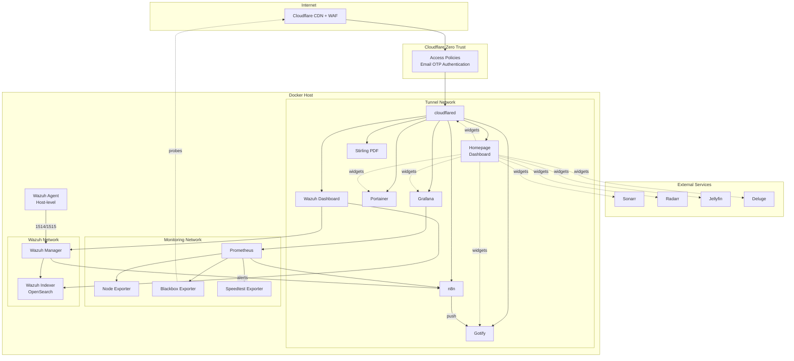
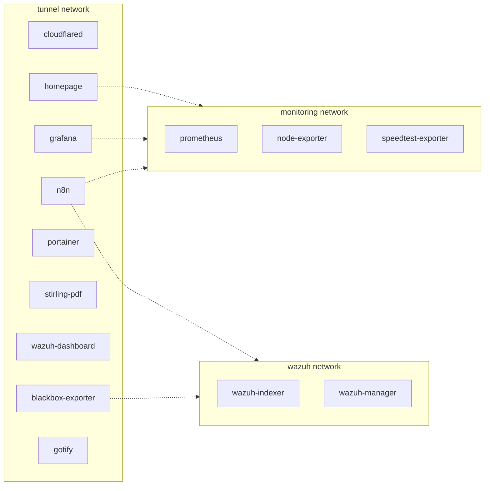
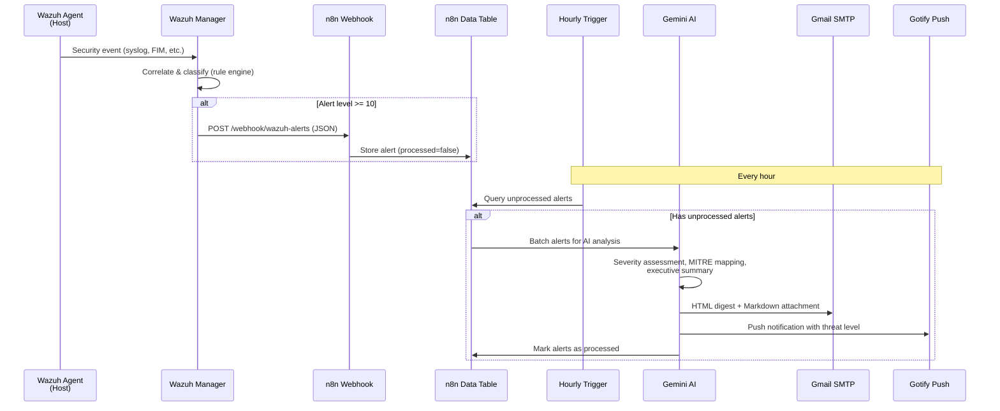

# Homelab

A single Docker Compose stack running 14 containers with Terraform-managed Cloudflare infrastructure. Everything is Infrastructure as Code — no manual configuration, no secrets in version control.

## Architecture



## Network Topology



Services connect to multiple networks as needed. Only `cloudflared` faces the internet. Prometheus, Node Exporter, and Speedtest Exporter have no tunnel access.

## Wazuh Alert Pipeline

The alert notification system uses a batch-and-triage architecture. Alerts are stored in an n8n Data Table and processed hourly with Gemini AI analysis, then delivered via email and push notification.



**Pipeline nodes (16 total, single workflow with dual triggers):**

| Path | Nodes |
|------|-------|
| **Ingest** | Wazuh Alert Webhook -> Extract Alert Fields -> Store in Data Table |
| **Digest** | Hourly Trigger -> Get Unprocessed Alerts -> Has Alerts? -> Prepare Prompt -> AI Analysis (Gemini) -> Parse Response -> Build Email & Markdown -> Send Email + Gotify Push + Mark Processed -> Update Data Table |

## Terraform Infrastructure


Terraform manages ~16 resources: the tunnel, its ingress config, 7 DNS records, and 6 Zero Trust access policies. All services except Gotify require email OTP authentication before reaching the application. Gotify uses token-based authentication only (the Android app cannot handle Cloudflare Access OTP).

## Services

| Service | Purpose | Public | Port |
|---------|---------|--------|------|
| **cloudflared** | Cloudflare Tunnel ingress | Gateway | - |
| **homepage** | Dashboard with service widgets | `https://domain.com` | - |
| **portainer** | Container management | `https://portainer.domain.com` | - |
| **stirling-pdf** | PDF manipulation tools | `https://pdf.domain.com` | - |
| **gotify** | Push notifications | `https://gotify.domain.com` | - |
| **n8n** | Workflow automation | `https://n8n.domain.com` | - |
| **grafana** | Metrics visualization | `https://grafana.domain.com` | - |
| **prometheus** | Metrics storage | Internal only | - |
| **node-exporter** | Host metrics collector | Internal only | - |
| **blackbox-exporter** | HTTP/ICMP probes | Internal only | - |
| **speedtest-exporter** | Internet speed metrics | Internal only | - |
| **wazuh-indexer** | OpenSearch alert storage | Internal only | - |
| **wazuh-manager** | SIEM analysis engine | Internal only | 1514, 1515, 55000 |
| **wazuh-dashboard** | Security monitoring UI | `https://wazuh.domain.com` | - |

## Security

### Double-Layer Authentication
Every public service is protected by two layers:
1. **Cloudflare Zero Trust** — email OTP gate before any traffic reaches the server
2. **Application-level login** — each service has its own credentials

**Exception:** Gotify is protected by Cloudflare Tunnel (no exposed ports) + WAF/DDoS protection + its built-in token authentication, but does **not** have a Cloudflare Access policy. The Gotify Android app makes direct HTTP/WebSocket calls and cannot handle the email OTP flow. Registration is disabled (`GOTIFY_REGISTRATION=false`).

### Container Hardening
All containers follow a hardened baseline:
- `security_opt: [no-new-privileges:true]`
- `cap_drop: [ALL]` — only add back capabilities that are strictly required
- `read_only: true` with `tmpfs` mounts where possible
- No containers expose ports to the host except Wazuh Manager (agent enrollment)

### Secrets Management
- **Docker**: All secrets live in `.env` (gitignored). Config files use `${VAR}` substitution.
- **Terraform**: Sensitive values in `terraform.tfvars` (gitignored). API token marked `sensitive = true`.
- **Homepage**: Uses `{{HOMEPAGE_VAR_*}}` template syntax — credentials injected via environment variables at runtime.
- **Portainer**: Admin password stored as a Docker secret (`./secrets/`).
- **Wazuh**: TLS certificates in `files/wazuh/certs/` (gitignored).

### Encrypted Files (git-crypt)

Some configuration files are version-controlled but encrypted at rest in the repository using [git-crypt](https://github.com/AGWA/git-crypt). These files contain security-sensitive data (e.g., Wazuh detection suppression rules that reveal monitoring blind spots) and appear as binary blobs in the repo unless unlocked.

**Currently encrypted files:**
- `files/wazuh/rules/local_rules.xml` — Custom Wazuh rules that suppress known false positives

**How it works:**
- Files matching patterns in `.gitattributes` are transparently encrypted on commit and decrypted on checkout
- The working tree always contains plaintext (when unlocked) — Docker can mount these files normally
- The symmetric key is stored in `.git/git-crypt/keys/default` (never pushed) and should be backed up externally

**Recovery (fresh clone):**

```bash
# 1. Install git-crypt
sudo apt-get install -y git-crypt

# 2. Clone the repository
git clone https://github.com/danielpsf/homelab.git
cd homelab

# 3. Restore the key from your external backup (decode the base64-encoded key back to a file)
echo '<base64-key>' | base64 -d > /tmp/homelab-git-crypt-key

# 4. Unlock the repository
git-crypt unlock /tmp/homelab-git-crypt-key

# 5. Verify and clean up
git-crypt status          # should show "encrypted:" for protected files
file files/wazuh/rules/local_rules.xml   # should show "XML" or "text"
rm /tmp/homelab-git-crypt-key
```

**To add more encrypted files:** Add a pattern to `.gitattributes`, then `git rm --cached <file> && git add <file>` to re-stage it through the encryption filter.

### AI-Powered Security Analysis

This project includes a custom [OpenCode](https://opencode.ai) skill that turns natural language requests into full-depth security investigations. When a Wazuh alert digest arrives or a manual security review is needed, the **security-analyst** skill orchestrates a multi-phase assessment:

1. **Proactive Attack Surface Audit** — scans network exposure, container hardening, authentication posture, firewall state, and host patch level before even reading the alert digest
2. **Alert Parsing & Correlation** — extracts structured fields from every alert, cross-references a local false positive catalog, groups related alerts by time and source, maps them to MITRE ATT&CK, and checks historical trends via the n8n data table
3. **Live Investigation** — dispatches parallel agents to investigate each alert group on the running system, collecting evidence and assessing compensating controls (network isolation, zero-trust policies, capability restrictions, read-only filesystems)
4. **Vulnerability Assessment** — scans all container images and the host filesystem with Trivy (pinned to a verified safe version with a supply chain safety protocol addressing CVE-2026-33634), cross-references findings against the CISA Known Exploited Vulnerabilities catalog and NVD, and reviews Wazuh SCA/CIS benchmark results
5. **Synthesis & Reporting** — assembles a structured security assessment with executive summary, threat matrix, detailed findings, prioritized remediation plan, Wazuh tuning recommendations, and active response proposals
6. **Supply Chain Assessment** — audits container image freshness, tag pinning, and registry trust

All investigation outputs — reports, scan results, and the false positive catalog — are stored locally in `.local/security/` and never committed to version control. The false positive catalog is maintained as a YAML file that accumulates institutional knowledge across investigations, reducing noise over time without embedding environment-specific data in the skill itself.

The skill is defined in `.opencode/skills/security-analyst/SKILL.md` and can be triggered by providing a Wazuh digest file or asking about the homelab's security posture.

## Project Structure

```
homelab/
├── docker-compose.yml              # All 14 services
├── .env.sample                     # Environment template (copy to .env)
├── .gitattributes                  # git-crypt encryption patterns
├── .gitignore
├── .opencode/
│   └── skills/
│       └── security-analyst/       # OpenCode skill for Wazuh alert investigation
│           └── SKILL.md
├── .local/                         # Local-only security data (gitignored)
│   └── security/
│       ├── false-positives.yml     # Known FP catalog (auto-maintained)
│       ├── investigations/         # Dated investigation reports
│       └── scans/                  # Trivy and CVE scan results
├── secrets/                        # Docker secrets (gitignored contents)
├── files/
│   ├── grafana/
│   │   └── provisioning/
│   │       ├── dashboards/         # 4 pre-built dashboards
│   │       │   ├── homelab-overview.json
│   │       │   ├── internet-connection.json
│   │       │   ├── n8n-system-health.json
│   │       │   └── node-exporter-host.json
│   │       └── datasources/
│   │           └── datasource.yml
│   ├── homepage/
│   │   ├── services.yaml           # Dashboard service definitions
│   │   ├── settings.yaml           # Layout configuration
│   │   ├── bookmarks.yaml
│   │   └── docker.yaml             # Docker socket config
│   ├── n8n/
│   │   └── workflows/
│   │       └── wazuh-ai-triage.json  # Sanitized workflow (import into n8n)
│   ├── prometheus/
│   │   ├── prometheus.yml          # Scrape configs
│   │   ├── blackbox.yml            # Probe configuration
│   │   └── pinghosts.yaml          # ICMP targets
│   └── wazuh/
│       ├── ossec.conf              # Manager configuration
│       ├── integrations/
│       │   └── custom-n8n          # Alert -> n8n webhook script
│       ├── rules/
│       │   └── local_rules.xml     # Custom suppression rules (git-crypt encrypted)
│       ├── certs/                  # TLS certificates (gitignored)
│       ├── indexer/
│       │   ├── opensearch.yml
│       │   └── internal_users.yml  # Bcrypt password hashes
│       └── dashboard/
│           └── entrypoint.sh
└── terraform/
    ├── main.tf                     # Tunnel + ingress config
    ├── dns.tf                      # CNAME records
    ├── access.tf                   # Zero Trust access policies
    ├── variables.tf
    ├── outputs.tf
    ├── versions.tf
    └── terraform.tfvars.sample     # Terraform variables template
```

## Getting Started

### Prerequisites
- Docker and Docker Compose
- [OpenTofu](https://opentofu.org/) or Terraform
- [git-crypt](https://github.com/AGWA/git-crypt) (for decrypting sensitive config files)
- A Cloudflare account with a domain
- (Optional) Google Gemini API key for AI-powered alert triage
- (Optional) SMTP credentials for email notifications
- (Optional) Gotify Android/iOS app for push notifications

### 1. Clone and configure

```bash
git clone https://github.com/danielpsf/homelab.git
cd homelab

# Decrypt sensitive config files (see "Encrypted Files" section for key recovery)
git-crypt unlock /path/to/homelab-git-crypt-key

# Docker environment
cp .env.sample .env
# Edit .env with your values (domain, passwords, API keys, etc.)

# Terraform variables
cp terraform/terraform.tfvars.sample terraform/terraform.tfvars
# Edit terraform.tfvars with Cloudflare credentials
```

### 2. Generate Wazuh certificates

Follow the [Wazuh Docker deployment guide](https://documentation.wazuh.com/current/deployment-options/docker/wazuh-container.html) to generate TLS certificates, then place them in `files/wazuh/certs/`.

### 3. Create required volumes and secrets

```bash
# External volumes for persistent data
docker volume create homelab_prometheus_data
docker volume create homelab_grafana_data

# Portainer admin password (Docker secret)
mkdir -p secrets
docker run --rm httpd:2-alpine htpasswd -nbB admin 'YourPassword' | cut -d: -f2 > secrets/portainer_admin_password
```

### 4. Deploy infrastructure

```bash
# Initialize and apply Terraform
cd terraform
tofu init    # or: terraform init
tofu apply   # or: terraform apply

# Copy the tunnel token from output to .env (CLOUDFLARE_TUNNEL_TOKEN)
cd ..
```

### 5. Start services

```bash
docker compose up -d
```

### 6. Set up Gotify (optional)

1. Open Gotify at `https://gotify.<your-domain>` and log in with the admin credentials from `.env`
2. Create an **Application** (e.g., "n8n Wazuh Alerts") — copy the app token for the n8n workflow
3. Create a **Client** (e.g., "Homepage Widget") — copy the client token to `HOMEPAGE_VAR_GOTIFY_KEY` in `.env`
4. Install the [Gotify Android app](https://github.com/gotify/android) and log in with the server URL and admin credentials

### 7. Restore the n8n workflow (optional)

1. Open n8n at `https://n8n.<your-domain>`
2. Create SMTP and Google Gemini credentials
3. Create a Data Table named `wazuh_alerts` with columns: `alert_id` (string), `rule_id` (string), `rule_level` (number), `rule_description` (string), `agent_name` (string), `timestamp` (string), `full_log` (string), `location` (string), `decoder` (string), `rule_groups` (string), `alert_json` (string), `processed` (boolean), `received_at` (string)
4. Import `files/n8n/workflows/wazuh-ai-triage.json`
5. Update placeholder values: `YOUR_DATA_TABLE_ID`, `YOUR_GEMINI_CREDENTIAL_ID`, `YOUR_SMTP_CREDENTIAL_ID`, `YOUR_GOTIFY_APP_TOKEN`, and the email addresses
6. Activate the workflow

### 8. Install Wazuh agent (optional)

Install the Wazuh agent on the host to monitor the system itself:

```bash
# Follow https://documentation.wazuh.com/current/installation-guide/wazuh-agent/
# Point the agent to localhost:1514
```

## Grafana Dashboards

Four pre-provisioned dashboards are included:

- **Homelab Overview** — container status, service health, resource usage
- **Internet Connection** — latency, packet loss, uptime probes, speedtest history
- **n8n System Health** — workflow executions, errors, API latency
- **Node Exporter Host** — CPU, memory, disk, network metrics

## Updating Wazuh Password Hashes

The `files/wazuh/indexer/internal_users.yml` file contains bcrypt-hashed passwords. When deploying your own instance, regenerate them:

```bash
# Generate a bcrypt hash for your password
docker run --rm -it amazon/opendistro-for-elasticsearch \
  /usr/share/elasticsearch/plugins/opendistro_security/tools/hash.sh -p 'YourNewPassword'
```

Replace the `hash` values in `internal_users.yml` with the output.

## License

This project is provided as-is for educational and personal use.
